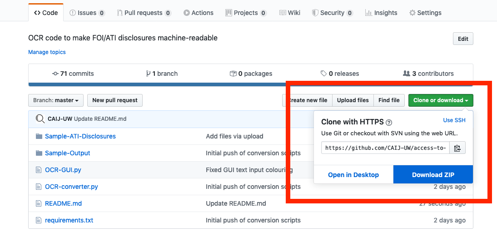

# Access to Information and Optical Character Recognition (OCR): Rendering Image Format Public Records Machine Readable Using Tesseract OCR
 - [Alex Luscombe](https://criminology.utoronto.ca/facultyandstaff/graduate-students/alex-luscombe/), University of Toronto
 - [Kevin Dick](https://www.linkedin.com/in/dickkevin/), Carleton University
 - [Jamie Duncan](https://www.jamieduncan.me), University of Toronto
 - [Kevin Walby](https://www.uwinnipeg.ca/criminal-justice/faculty-staff/kevin-walby.html), University of Winnipeg

## Overview
It is a perennial problem in Canada that municipal, provincial, and federal government agencies disclose records under Access to Information (ATI)/Freedom of Information (FOI) law in non-machine readable (image) formats by default. Lengthy reports, emails, and excel files are often printed and scanned by access coordinators before they are released to the requester. In some cases, coordinators may be willing to release the data in a "raw" format, however, this is not always the case, and inexperienced requesters may not even realize that this is something they can ask for (indeed, they may not even realize the thousands of pages they have requested are coming in image format before it is too late).

The inability to machine read these texts limits the analytic techniques that may be applied. It is also a barrier to access. Government agencies often "over produce" when processing requests by including mounds of irrelevant text as part of one's disclosure package. Manually sifting through thousands of pages of image format documents disclosed under ATI/FOI in search of one or two lines or key words becomes the equivalent of finding a needle in a haystack.

Fortunately, there exist a number of free and open-source solutions to this problem. In the field of computer science, transforming scanned images into machine readable text is widely considered to be a "solved" problem. One state-of-the-art solution is the *Tesseract Optical Character Recognition* (OCR) engine, considered to be one of the best OCR engines available.

The goal of this project is to show you how to use Tesseract OCR, which we have made easily accessible to you with some simple Python code. It is part of a larger series of projects the [CAIJ](https://www.uwinnipeg.ca/caij/) team intends to launch to promote computer literacy and algorithmic tools among non-computer scientists.  We hope to improve access to open-source tools that can eliminate many of the barriers to accessing information. The ability to convert a document into a format that can be searched for keywords, phrases, and possibly studied using natural language processing (NLP) methods alongside more traditional qualitative ones promises to revolutionize social sciences research.

## Tesseract is powerful, but not perfect
While the Tesseract OCR engine is highly effective, it is not perfect. ATI/FOI disclosures are typically printed and scanned copies of records so depending on their quality, not all characters may be properly recognized (though you will be surprised how effective it really is). Moreover, ATI/FOI disclosures generally contain redactions in the form of white, grey, or black boxes covering undisclosed information. Finally, complex character layouts (like in some tables) may not come out in logical order in the final output, a limitation of any OCR engine, not just Tesseract. 

Depending on the quality, layout, and format of the ATI/FOI records, it is therefore likely that some degree of document "cleaning" will be required after processing them. Cleaning can be effectively streamlined by following what computer scientists call the "[human-in-the-loop](https://en.wikipedia.org/wiki/Human-in-the-loop)" paradigm, which we plan to cover in a future tutorial.

## Open-source vs proprietary OCR
Tesseract OCR is completely free. Proprietary OCR software by contrast can be quite expensive. There is also no restriction to how many documents you can process using Tesseract OCR, whereas most proprietary software will limit the number of pages you can process (usually until you pay more). Depending on the software you purchase, it may also be less effective than Tesseract, which is recognized as one of the best OCR engines available. Finally, by using an open source tool we generate transparent, reproducible code that can be shared with others or adapted for future purposes. 

## Let's get started

### Companion Video

](https://www.youtube.com/watch?v=qs2jO61_Vk8&feature=youtu.be)

### Tutorial (compatible with MacOS & Linux):
This tutorial will walk you through how to render your scanned, image-based documents (including PDFs) into a machine-readable, text-based format. The tutorial is designed to build skills for the use of open-source software to improve access to information generally. We cover the high-level steps required to convert a large scanned PDF format document into a machine-readable and searchable .txt format. We recommend beginning by following the steps using the sample pdf file provided in the "Sample-Files" folder in the repository. 


#### Step one: download the repository
Download the repository, unzip the folder, and save it locally on your computer's hard drive. 



#### Step two: open your computer's command prompt
Open your computer's command prompt. On MacOS, this is called the Terminal. To open the Terminal, simply press Command + Space and type the word "Terminal" in the search bar. Double click the Terminal application listed under Top Hit to open it.

#### Step three: install Homebrew
*If you already have Homebrew installed on your computer, skip this step.*

If you unsure if you have homebrew installed, type the following line into your computer's Terminal:
```
brew help
```
If it returns "command not found", you do not have homebrew installed on your computer.

You can download Homebrew by entering the following command into your computer's Terminal:
```
/bin/bash -c "$(curl -fsSL https://raw.githubusercontent.com/Homebrew/install/master/install.sh)"
```

#### Step four: install Ghostscript using Homebrew
*If you already have Ghostscript installed on your computer, skip this step.*

If you unsure if you have Ghostscript installed, type the following line into your computer's Terminal:
```
ghostscript help
```
If it returns "command not found", you do not have Ghostscript installed on your computer.

You can download Ghostscript by entering the following command into your computer's Terminal:
```
brew install ghostscript
```

#### Step five: install Tesseract using Homebrew
*If you already have Tesseract installed on your computer, skip this step.*

If you unsure about whether you have Tesseract installed, type the following line into your computer's Terminal:
```
tesseract help
```
If it returns "command not found", you do not have Tesseract installed on your computer.

You can download Tesseract by entering the following command into your computer's Terminal:
```
brew install tesseract
```

#### Step six: copy the pathname of the folder you downloaded, unzipped, and saved in step one
We need to obtain the full directory pathname to the folder that you downloaded, unzipped, and saved in step one. This is a copy of the repository and contains the sample file and Python script we will need to run the Tesseract OCR engine. To obtain the exact pathname to this folder, simply open the folder on your computer, click the gear icon at the top of the window, and select the "copy as Pathname" option from the list. This will copy the full pathname to your clipboard.


	
#### Step seven: change your working directory in the Terminal
We will now change our working directory using the pathname you just copied to your clipboard. To do this, return to the Terminal and type "cd" followed by the pathname we just copied (you can paste it with command + V). The end result will look something like this (think of this as the basic formula):
```
cd path/name
```
So, if your name is Jane Doe, and you saved the folder on your desktop, it should look something like this:
```
cd /users/janedoe/desktop/access-to-information-ocr-master
```
To double check that you are in the correct directory, you can enter the following command into your Terminal, which will tell you the name of your current directory and display the name of the files contained in it:
```
ls
```
If you are in the correct directory, the "ls" command should show the name of all of the files stored in the master folder, including the most important ones, ORC-converter.py and requirements.txt. If this is not the case, you may need to ensure the "cd" command worked properly, or return to step six.

#### Step eight: create an output folder
To process our sample ATI/FOI disclosure file to make it machine readable, we are going to first parse the file into individual pages, run each of these through the Tesseract OCR engine, and finally recompile the .txt files generated from each page into a single .txt file that we can then clean, search, and analyze. Throughout these processing stages, a lot individual .png and .txt files are going to be generated, and these need to be stored somewhere.

Inside the access-to-information-ocr-master folder, our working directory, create a new folder. You can call this folder whatever you'd like. If you are using one of the sample data files in the Sample-Files folder, you might name the folder after the sample record you are processing by calling it "A-2017-00078". 

The structure of the command is (again, think of this as a formula you can follow):
```
mkdir subfolder-name
```
So, if you are going to call this folder "A-2017-00078", you would enter the following into your computer's Terminal:
```
mkdir A-2017-00078
```

To verify that this worked, enter the "ls" command that we learned earlier into the Terminal:
```
ls
```
You should now see the name of your new subfolder listed with the other files in your working directory.

#### Step nine: ensure you have Python 3 installed on your computer

Python is available on all MacOS computers by default, but depending on the age of your computer, you may need to update it to version 3. To do this, use homebrew to install python3 by entering the follow into your Terminal:
```
brew install python3
```

#### Step ten: load in the requirements.txt file
Before we can run our python script, we need to install two key python libraries. To do this, enter the following into the Terminal:
```
pip3 install -r requirements.txt
```

#### Step eleven: run the script
We are now ready to process our file! This stage can take several minutes (or hours) depending on the size of the file. Processing will happen in three stages. First, the PDF will be parsed into individual page elements (using Ghostscript). Second, each page will be processed into a machine readable .txt file with Tesseract. Third, each page (the .txt files) will be recompiled into a single .txt file named after the PDF.

To do this, we will run a simple Python script (in your working directory, this is the OCR-converter.py file). Same as the previous steps, we will run this script in the Terminal.

To run the Python script, all we need to do is obtain the correct pathname for our input file (if you are following along with the example, one of the sample ATI/FOI disclosure files) and the correct pathname for our output file (the subfolder we created in step eight) and we are ready to go.

The basic command formula is:
```
python3 OCR-converter.py -i input/file/pathname -o output/folder/pathname
```
So, let's say we are going to run the script on the A-2017-00078.pdf file in the Sample-Files subfolder, and we are going to store the results in the subfolder we created in step eight called A-2017-00078. The result would look like this:
```
python3 OCR-converter.py -i Sample-Files/A-2017-00078.pdf -o A-2017-00078
```
Enter this into your Terminal, sit back, and relax (but don't change anything in the master folder until the code is completely finished running!). The end result will be a single .txt file in the output subfolder you created by the same name as the PDF file you processed (e.g., A-2017-00078.txt). 

### Next steps

Now you are ready to try it with your own files!
